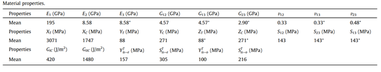
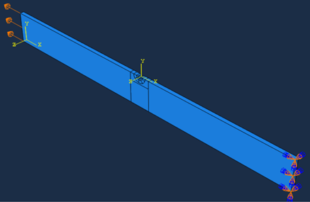

# PDA-2D-UMAT-Subroutine
Progressive Damage Analysis (Modified Yamada-Sun / Hashin)

A progressive damage analysis with only unidirectional layer properties required is proposed to predict the failure of notched composite. Two progressive damage models (PDMs), Hashin or modified Yamada–Sun criterion and Camanho’s degradation rules are recommended. The following is a UMAT subroutine for both Hashin and Modified Yamada-Sun failure criterion in Abaqus. 

# Model definition

The model was made of carbon/epoxy composites X850 with commonly-used balanced symmetric stacking sequence of [45/0/-45/0/90/0/45/0/-45/0]s.

  

# Investigated Geometry and Notch Analysis
The gemoetry consists of layered composite consisting of 20 layers, with one of the composite walls featuring an asymmetric notchis. The geometry and dimensions of the examined sample are visually detailed in Figure 1. The notch's geometry is extracted from reference [1], where the irregularities on the surface, as introduced in the reference, have been digitized. Subsequently, the critical notch geometry has been selected and thoroughly examined, representing the existing notch in this sample. The evaluated notch geometry is visually presented in Figure 1.

In the simulation, Figure 2 has been utilized to determine the one-way elastic properties and required reinforcements for each layer based on the selected composite. The * parameters have been derived from calculations and engineering assumptions.

  

# Evaluation and Comparison of Failure Indicators in Abaqus Simulation

To assess and compare two types of failure indicators, a simple loading approach has been implemented on the parts. This involved modeling the tensile behavior by applying a displacement to one side of the parts, while the other side was subjected to specific boundary conditions. The loads and boundary conditions applied to the parts can be observed in Figure 3. A displacement of 4.5 mm was precisely applied to ensure the final failure of the parts.

  

This refined text provides a more engaging and informative description of the investigated geometry and notch analysis for potential users of your GitHub repository.

# Progressive Damage Analysis and Damage Assessment

The comprehensive analysis of the PDA hinges on the precise determination of two fundamental parameters:
- Identification of the employed failure criterion (Failure Criterion)
- Establishment of the model for the degradation of mechanical properties (Material Degradation Model)

As part of this study, the Hashin and Modified Yamada-Sun failure criteria have been meticulously scrutinized. These two criteria, as delineated in Figure 4, have been integrated into the evaluations to gauge their efficacy.

  

# Hashin criteria
In Abaqus, the Hashin failure criterion is available only to shell and continuum shell elements. Therefore this UMAT subroutine has been written, which can be used for continuum solid elements. The equations for the different failure modes are given below.
### Fiber Failure in Tension
When $\sigma_{11} > 0$
$$F_f = \Big(\frac{\sigma_{11}}{X_T}\Big)^2 + \frac{1}{S_{12}^2}( \tau_{12}^2 + \tau_{13}^2 )$$

### Fiber Failure in Compression
When $\sigma_{11} < 0$
$$F_f = \Big(\frac{-\sigma_{11}}{X_C}\Big)^2$$

### Matrix Failure in Tension
When $\sigma_{22} + \sigma_{33} > 0$
$$F_m = \frac{1}{Y_T^2}( \sigma_{22}^2 + \sigma_{33}^2) + \frac{1}{S_{23}^2}( \tau_{23}^2 - \sigma_{22}\sigma_{33}) + \frac{1}{S_{12}^2}( \tau_{12}^2 + \tau_{13}^2)$$

### Matrix Failure in Compression
When $\sigma_{22} + \sigma_{33} < 0$
$$F_m = \frac{1}{Y_C} \Bigl[  \Bigl(\frac{Y_C}{2S_{23}}\Bigr)^2  - 1 \Bigr] (\sigma_{22} + \sigma_{33}) + \frac{1}{4S_{23}^2}(\sigma_{22} + \sigma_{33})^2 + \frac{1}{S_{23}^2}( \tau_{23}^2 - \sigma_{22}\sigma_{33}) + \frac{1}{S_{12}^2}( \tau_{12}^2 + \tau_{13}^2)$$

# Modified Yamada-Sun Criteria
### Fiber Failure in Tension
When $\sigma_{11} > 0$
$$F_f = \Big(\frac{\sigma_{11}}{X_T}\Big)^2 + \Big(\frac{\sigma_{12}}{S_C}\Big)^2$$

### Fiber Failure in Compression
When $\sigma_{11} < 0$
$$F_f = \Big(\frac{\sigma_{11}}{X_C}\Big)^2 + \Big(\frac{\sigma_{12}}{S_C}\Big)^2$$

### Matrix Failure in Tension
When $\sigma_{22} + \sigma_{33} > 0$
$$F_m = \Big(\frac{\sigma_{22}}{Y_T}\Big)^2 + \Big(\frac{\sigma_{12}}{S_C}\Big)^2$$

### Matrix Failure in Compression
When $\sigma_{22} + \sigma_{33} > 0$
$$F_m = \Big(\frac{\sigma_{22}}{S_C}\Big)^2 + \Bigl[  \Bigl(\frac{Y_C}{2S_C}\Bigr)^2  - 1 \Bigr] \Big(\frac{\sigma_{22}}{Y_C}\Big) +  \Big(\frac{\sigma_{12}}{S_C}\Big)^2$$

### Fiber-Matrix shear
$$F_f = \Big(\frac{\sigma_{11}}{X_T}\Big)^2 + \Big(\frac{\sigma_{12}}{S_C}\Big)^2$$

# Input to the Model

The following properties need to be entered in the following order.
  * Youngs Modulus in 11 Direction $E_{11}$
  * Youngs Modulus in 22 Direction $E_{22}$
  * Youngs Modulus in 33 Direction $E_{33}$
  * Poisson's Ratio in 1-2 Plane $\nu_{12}$
  * Poisson's Ratio in 1-3 Plane $\nu_{13}$
  * Poisson's Ratio in 2-3 Plane $\nu_{23}$
  * Inplane Shear Modulus $G_{12}$
  * Inplane Shear Modulus $G_{13}$
  * Inplane Shear Modulus $G_{23}$
  * Longitudinal Strength in 11 Direction $X_T$
  * Compressive Strength in 11 Direction $X_C$
  * Longitudinal Strength in 22 Direction $Y_T$
  * Compressive Strength in 22 Direction $Y_C$
  * Longitudinal Strength in 33 Direction $Z_T$
  * Compressive Strength in 33 Direction $Z_C$
  * Inplane Shear Strength $S_{12}$
  * Inplane Shear Strength $S_{13}$
  * Transverse Shear Strength $S_{23}$
# Output Visualization
 
There are five solution-dependent state variables For each failure mode. They are as follows
  * SDV9 : Fiber Failure in Tension
  * SDV10 : Fiber Failure in Compression
  * SDV11 : Matrix Failure in Tension
  * SDV12 : Matrix Failure in Compression
  * SDV13 : Fiber-Matrix shear (Only for Modified Yamada-Sun Criteria)
